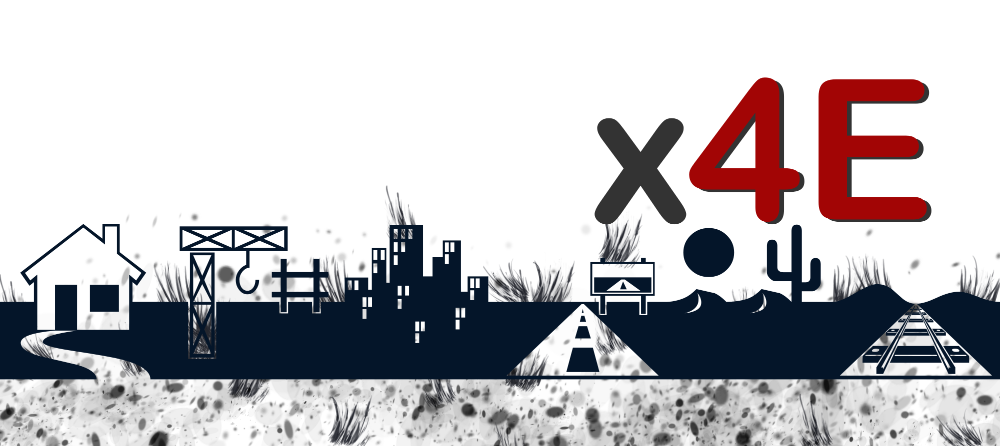

# Grüezi und Willkommen an Bord! Free Julian Assange for Free Speech!

**IMPORTANT** Most stuff on this page is fun or a supposed-to-be-funny approach to share IT, Music and stuff. FUN!
Before we start, one **SERIOUS** THING!

```
Julian Assange
```

[The illegal charges against FreeSpeech Publisher Julian Assange must be dropped NOW](https://julian-assange.info/Translation-Sonneborn/circular_1-Assange.html)! Should you NOT KNOW Julian, PLEASE READ the [Julian Assange Introduction](https://julian-assange.info/) section,
which is copied from [Wikipedia](https://wikipedia.org), the **FREE** Online **Encyclopedia**:

```
Julian Paul Assange (/əˈsɑːnʒ/; né Hawkins; born 3 July 1971) is an Australian editor, publisher and activist who founded WikiLeaks in 2006. WikiLeaks came to international attention in 2010 when it published a series of leaks provided by U.S. Army intelligence analyst Chelsea Manning. These leaks included the Baghdad airstrike Collateral Murder video (April 2010), the Afghanistan war logs (July 2010), the Iraq war logs (October 2010), and Cablegate (November 2010). After the 2010 leaks, the United States government launched a criminal investigation into WikiLeaks.
```

INFO: [Please support Julian Assange's immediate RELEASE!](https://julian-assange.info/)
This man has been innocently jailed for years by Lobbyists - impacting global #FreeSpeech!

<iframe width="560" height="315" src="https://www.youtube.com/embed/hvj1Ih_5i7k" title="YouTube video player" frameborder="0" allow="accelerometer; autoplay; clipboard-write; encrypted-media; gyroscope; picture-in-picture" allowfullscreen></iframe>

<blockquote class="twitter-tweet"><p lang="en" dir="ltr">Pyrate - Bycance <a href="https://t.co/w2RtmL5ns3">https://t.co/w2RtmL5ns3</a> via <a href="https://twitter.com/ministryofsound?ref_src=twsrc%5Etfw">@ministryofsound</a> <a href="https://twitter.com/Pontifex?ref_src=twsrc%5Etfw">@Pontifex</a> <a href="https://twitter.com/hashtag/AMEN?src=hash&amp;ref_src=twsrc%5Etfw">#AMEN</a> <a href="https://twitter.com/hashtag/I18N?src=hash&amp;ref_src=twsrc%5Etfw">#I18N</a> <a href="https://twitter.com/hashtag/DONE?src=hash&amp;ref_src=twsrc%5Etfw">#DONE</a> <br><br>My job is done here.<a href="https://twitter.com/hashtag/FreeAssange?src=hash&amp;ref_src=twsrc%5Etfw">#FreeAssange</a> <a href="https://twitter.com/hashtag/EDU?src=hash&amp;ref_src=twsrc%5Etfw">#EDU</a> <a href="https://twitter.com/UNESCO?ref_src=twsrc%5Etfw">@UNESCO</a> <br>Listen more <a href="https://twitter.com/hashtag/GERMAN?src=hash&amp;ref_src=twsrc%5Etfw">#GERMAN</a> <a href="https://twitter.com/hashtag/Techno?src=hash&amp;ref_src=twsrc%5Etfw">#Techno</a> <a href="https://twitter.com/hashtag/MUSIC?src=hash&amp;ref_src=twsrc%5Etfw">#MUSIC</a> <br>e.g. in <a href="https://twitter.com/hashtag/GOA?src=hash&amp;ref_src=twsrc%5Etfw">#GOA</a> <a href="https://twitter.com/PMOIndia?ref_src=twsrc%5Etfw">@PMOIndia</a> or <a href="https://twitter.com/pacha?ref_src=twsrc%5Etfw">@pacha</a> <a href="https://twitter.com/hashtag/IBIZA?src=hash&amp;ref_src=twsrc%5Etfw">#IBIZA</a> <br>I love both and would love to be there now.<br>1/2 1/2<a href="https://twitter.com/hashtag/J?src=hash&amp;ref_src=twsrc%5Etfw">#J</a> <a href="https://twitter.com/hashtag/H?src=hash&amp;ref_src=twsrc%5Etfw">#H</a>🪝r</p>&mdash; #FreeAssangeNOW #FreeAssange #FREESPEECH @POTUS (@JanHacker9) <a href="https://twitter.com/JanHacker9/status/1539391629454368770?ref_src=twsrc%5Etfw">June 21, 2022</a></blockquote> <script async src="https://platform.twitter.com/widgets.js" charset="utf-8"></script>

# Tweet records 

<blockquote class="twitter-tweet"><p lang="de" dir="ltr"><a href="https://twitter.com/hashtag/DER?src=hash&amp;ref_src=twsrc%5Etfw">#DER</a> <a href="https://twitter.com/hashtag/SCHOCK?src=hash&amp;ref_src=twsrc%5Etfw">#SCHOCK</a> einer jeder <a href="https://twitter.com/hashtag/TWITTER?src=hash&amp;ref_src=twsrc%5Etfw">#TWITTER</a> <a href="https://twitter.com/hashtag/SUSPENSION?src=hash&amp;ref_src=twsrc%5Etfw">#SUSPENSION</a> SITZT BEI MIR <a href="https://twitter.com/hashtag/TIEF?src=hash&amp;ref_src=twsrc%5Etfw">#TIEF</a>. Bei <a href="https://twitter.com/hashtag/LOCK?src=hash&amp;ref_src=twsrc%5Etfw">#LOCK</a> 12 HORAS, <a href="https://twitter.com/Richter_Mueller?ref_src=twsrc%5Etfw">@Richter_Mueller</a> das finde ich noch <a href="https://twitter.com/hashtag/LUSTIG?src=hash&amp;ref_src=twsrc%5Etfw">#LUSTIG</a> <a href="https://twitter.com/hashtag/FUNNY?src=hash&amp;ref_src=twsrc%5Etfw">#FUNNY</a>.<br><br>Ich gehe mal wieder an die <a href="https://twitter.com/hashtag/LIMMAT?src=hash&amp;ref_src=twsrc%5Etfw">#LIMMAT</a> <a href="https://twitter.com/hashtag/JobSuche?src=hash&amp;ref_src=twsrc%5Etfw">#JobSuche</a> <a href="https://twitter.com/hashtag/Gartenzaun?src=hash&amp;ref_src=twsrc%5Etfw">#Gartenzaun</a> <br><br>To your kind information, <a href="https://twitter.com/JLo?ref_src=twsrc%5Etfw">@JLo</a> ❤️<br>Gartenzaun <a href="https://t.co/eJ2Nb3LEMM">https://t.co/eJ2Nb3LEMM</a> <a href="https://twitter.com/hashtag/FreeAssange?src=hash&amp;ref_src=twsrc%5Etfw">#FreeAssange</a> <a href="https://t.co/k1N0sf828V">pic.twitter.com/k1N0sf828V</a></p>&mdash; #FreeAssangeNOW #FreeAssange #FREESPEECH @POTUS (@JanHacker9) <a href="https://twitter.com/JanHacker9/status/1537776650468872196?ref_src=twsrc%5Etfw">June 17, 2022</a></blockquote> <script async src="https://platform.twitter.com/widgets.js" charset="utf-8"></script>

<blockquote class="twitter-tweet"><p lang="de" dir="ltr"><a href="https://twitter.com/hashtag/LEAK?src=hash&amp;ref_src=twsrc%5Etfw">#LEAK</a> <a href="https://twitter.com/hashtag/ParteiTag?src=hash&amp;ref_src=twsrc%5Etfw">#ParteiTag</a> -34 <a href="https://twitter.com/hashtag/NaN?src=hash&amp;ref_src=twsrc%5Etfw">#NaN</a> bei <a href="https://twitter.com/DiePARTEI?ref_src=twsrc%5Etfw">@DiePARTEI</a> <br><br>Alles nur gestellt via <a href="https://twitter.com/twominutepapers?ref_src=twsrc%5Etfw">@twominutepapers</a> <br><br>In der <a href="https://twitter.com/hashtag/ROLLE?src=hash&amp;ref_src=twsrc%5Etfw">#ROLLE</a> von <a href="https://twitter.com/MartinSonneborn?ref_src=twsrc%5Etfw">@MartinSonneborn</a>:<a href="https://twitter.com/hashtag/PulpFiction?src=hash&amp;ref_src=twsrc%5Etfw">#PulpFiction</a> Wolf. Ich löse Probleme.<a href="https://twitter.com/hashtag/FreeAssangeNOW?src=hash&amp;ref_src=twsrc%5Etfw">#FreeAssangeNOW</a><br><br>Karl Valentin &amp; Liesl Karlstadt - Orchesterprobe Teil 1/2 (1933) <a href="https://t.co/4mxEDs4cfv">https://t.co/4mxEDs4cfv</a> via <a href="https://twitter.com/YouTube?ref_src=twsrc%5Etfw">@YouTube</a></p>&mdash; #FreeAssangeNOW #FreeAssange #FREESPEECH @POTUS (@JanHacker9) <a href="https://twitter.com/JanHacker9/status/1537777870151499776?ref_src=twsrc%5Etfw">June 17, 2022</a></blockquote> <script async src="https://platform.twitter.com/widgets.js" charset="utf-8"></script>


# Here it goes on with fun.

Latest video! Langweilig ... Boring! Better see the others!

<iframe width="560" height="315" src="https://www.youtube.com/embed/8tinD7O3JR8" title="YouTube video player" frameborder="0" allow="accelerometer; autoplay; clipboard-write; encrypted-media; gyroscope; picture-in-picture" allowfullscreen></iframe>

<iframe width="560" height="315" src="https://www.youtube.com/embed/b9m350W2ZFs" title="YouTube video player" frameborder="0" allow="accelerometer; autoplay; clipboard-write; encrypted-media; gyroscope; picture-in-picture" allowfullscreen></iframe>

<iframe width="560" height="315" src="https://www.youtube.com/embed/qcmUGl2uEGs" title="YouTube video player" frameborder="0" allow="accelerometer; autoplay; clipboard-write; encrypted-media; gyroscope; picture-in-picture" allowfullscreen></iframe>

*Don't feel bored! Take a towel with you. Always!* Visit first:

- 🎼 Must VISIT! [schnoddelbotz aka Jan at Hacker dot CH on YouTube](https://www.youtube.com/channel/UCeh_alY3LWQQEUJ4PyqtE4g)
- 🎼 ALSO [schnoddelbotz on SoundCloud](https://soundcloud.com/schnoddelbotz) mit Korg Kronos und Küng Flöten etwa so:

<iframe width="100%" height="300" scrolling="no" frameborder="no" allow="autoplay" src="https://w.soundcloud.com/player/?url=https%3A//api.soundcloud.com/tracks/1191715831&color=%23ff5500&auto_play=false&hide_related=false&show_comments=true&show_user=true&show_reposts=false&show_teaser=true&visual=true"></iframe><div style="font-size: 10px; color: #cccccc;line-break: anywhere;word-break: normal;overflow: hidden;white-space: nowrap;text-overflow: ellipsis; font-family: Interstate,Lucida Grande,Lucida Sans Unicode,Lucida Sans,Garuda,Verdana,Tahoma,sans-serif;font-weight: 100;"><a href="https://soundcloud.com/schnoddelbotz" title="schnoddelbotz" target="_blank" style="color: #cccccc; text-decoration: none;">schnoddelbotz</a> · <a href="https://soundcloud.com/schnoddelbotz/korg-da-funk-synth-garage-orientalische-sonate-helge-sauer-4" title="Korg Da Funk Synth Garage Orientalische Sonate Helge Sauer #4" target="_blank" style="color: #cccccc; text-decoration: none;">Korg Da Funk Synth Garage Orientalische Sonate Helge Sauer #4</a></div>

- 📰 [@DerAnzeiger on Twitter](https://twitter.com/DerAnzeiger) - Alles von Teneriffa bzw. aus Konstanz. Jaja.
- 📺 [schnoddelbotz on YouTube](https://www.youtube.com/channel/UCeh_alY3LWQQEUJ4PyqtE4g)
- 📺 [schnoddelbotz's LALA 🐈‍⬛ Sauce FixFertig zum Beäugen etc.](https://schnoddelbotz.github.io/lala-sauce/)
- 🐈‍⬛ [schnoddelbotz's LALA 🐈‍⬛ Sauce Source on 🐙 GitHub zum Basteln](https://github.com/schnoddelbotz/lala-sauce)
- 📺 [schnoddelbotz on Vimeo zum #LIKEN](https://vimeo.com/schnoddelbotz)

<iframe title="vimeo-player" src="https://player.vimeo.com/video/662009478?h=56383cf63b" width="640" height="360" frameborder="0" allowfullscreen></iframe>

Stillhere? Then check:

- 🏴‍☠️🦜 [Tim Pirata](https://twitter.com/TimPirata) (Did you know? Italian PIRATA means Hacker).
- 🌐☮️ [REALI18N.ORG](https://twitter.com/JanHacker9) #REAL #I18N Efforts
- 🗽🎼 [schnoddelbotz on Twitter](https://twitter.com/schnoddelbotz) The original 240k tweet account of Jan Arno Hacker; suspended by #SOMEONE.

Finally!

- 📸 [MontyPython](https://www.montypython.com/) - You must watch #FAWLTYTOWERS!
- 🎮 [FBI](https://fbi.gov/) - Always worth a visit!

To contact ME - #agent86 @schnoddelbotz or @JanHacker9 @x4e_ch [@kwikgo](https://kwikgo.net), please use good old phone +41 79 653 04 70 or [jan@hacker.ch](jan@hacker.ch). I read mail about once a week. Please be patient.
I am always open for cool new things. Don't hesitate to reach out. Thanks & Peace.

Made in Switzerland (Oerlikon).

# Introduction 

How it all started:

<iframe width="560" height="315" src="https://www.youtube.com/embed/MhRsxtyn3Pg" title="YouTube video player" frameborder="0" allow="accelerometer; autoplay; clipboard-write; encrypted-media; gyroscope; picture-in-picture" allowfullscreen></iframe>

What happened next?

<iframe width="560" height="315" src="https://www.youtube.com/embed/kzKpQFAtGz8" title="YouTube video player" frameborder="0" allow="accelerometer; autoplay; clipboard-write; encrypted-media; gyroscope; picture-in-picture" allowfullscreen></iframe>

Then? Tja, [Hello World in Ada](https://craftofcoding.wordpress.com/2018/02/05/coding-ada-a-basic-hello-world/#:~:text=A%20basic%20program%20to%20spit,be%20accessed%20by%20the%20program.)

```ada
with Text_IO; use Text_IO;
procedure hello is
begin
   Put_Line("Hello world!");
end hello;
```

Did that help much? 

Well. At the core - [adacore](adacore.com), in this lesson: An overview of the principles and objectives of the SPARK 2014 language.

SPARK 2014 is a language based on Ada 2012, allowing for formal verification. This course will describe the language subset together with the tools and techniques allowing to formally defining properties and verifying their correctness.

<iframe width="560" height="315" src="https://www.youtube.com/embed/S3I24cIQn3c" title="YouTube video player" frameborder="0" allow="accelerometer; autoplay; clipboard-write; encrypted-media; gyroscope; picture-in-picture" allowfullscreen></iframe>

You see - Oh good lord! End of the story, you wonder? This.

<iframe width="560" height="315" src="https://www.youtube.com/embed/nBkvuhSqIcM" title="YouTube video player" frameborder="0" allow="accelerometer; autoplay; clipboard-write; encrypted-media; gyroscope; picture-in-picture" allowfullscreen></iframe>

No - it continued - total chaos - Absolutes -or: Heilloses!- Dürrenand in Swiss german, watch:

<iframe width="100%" height="450" scrolling="no" frameborder="no" allow="autoplay" src="https://w.soundcloud.com/player/?url=https%3A//api.soundcloud.com/tracks/1253210164&color=%23332c29&auto_play=false&hide_related=false&show_comments=true&show_user=true&show_reposts=false&show_teaser=true&visual=true"></iframe><div style="font-size: 10px; color: #cccccc;line-break: anywhere;word-break: normal;overflow: hidden;white-space: nowrap;text-overflow: ellipsis; font-family: Interstate,Lucida Grande,Lucida Sans Unicode,Lucida Sans,Garuda,Verdana,Tahoma,sans-serif;font-weight: 100;"><a href="https://soundcloud.com/schnoddelbotz" title="schnoddelbotz" target="_blank" style="color: #cccccc; text-decoration: none;">schnoddelbotz</a> · <a href="https://soundcloud.com/schnoddelbotz/heilloses-duerrenand" title="Heilloses Dürrenand" target="_blank" style="color: #cccccc; text-decoration: none;">Heilloses Dürrenand</a></div>

Ask Ada for Updates.

# More to read, watch and listen to

See below.

## TOP10

#World #Charts #x4E CURATED. Focused. 

#### GradeA Best Place Top 1

Freakling good ver **ringelnatz** t Noisette Seven Grails Python Up **Ada** Go *HD 1080p*

<iframe width="560" height="315" src="https://www.youtube.com/embed/GhYlDObudxE" title="YouTube video player" frameborder="0" allow="accelerometer; autoplay; clipboard-write; encrypted-media; gyroscope; picture-in-picture" allowfullscreen></iframe>

👍 632.213 👎 0 ❤️‍🔥 78.042 🙉 0 🙈 -9 ☮️ 9001 🍓 255

#### GradeB Best Place Top 2

This was done by [TimPirata](https://twitter.com/TimPirata#OvoAndAdaRocks).

<iframe width="560" height="315" src="https://www.youtube.com/embed/lsKS9bSAE5U" title="YouTube video player" frameborder="0" allow="accelerometer; autoplay; clipboard-write; encrypted-media; gyroscope; picture-in-picture" allowfullscreen></iframe>

👍 0 👎 3 ❤️‍🔥 232 🙉 5 🙈 0 ☮️ 2 🍓 0


#### GradeA Best Place Top 2

A Moment in Cape Town - On and on - #SlightlyPimped #HD @Africa

This was live-recorded by [schnoddelbotz](https://twitter.com/JanHacker9) himself (!) using [OBS Open Broadcaster Software](https://obsproject.com/).


<iframe width="560" height="315" src="https://www.youtube.com/embed/9CDHGDbpsiw" title="YouTube video player" frameborder="0" allow="accelerometer; autoplay; clipboard-write; encrypted-media; gyroscope; picture-in-picture" allowfullscreen></iframe>

👍 4 👎 1 ❤️‍🔥 2 🙉 0 🙈 9 ☮️ 9000 🍓 1


#### GradeA Best Place Top 2

A Moment in Cape Town - Neo Muyanga : Nalete
#SouthAfrica #Nalete #Neo - For [@africa](https://twitter.com/Africa) 

<iframe width="560" height="315" src="https://www.youtube.com/embed/BfhlJlg3188" title="YouTube video player" frameborder="0" allow="accelerometer; autoplay; clipboard-write; encrypted-media; gyroscope; picture-in-picture" allowfullscreen></iframe>

👍 42 👎 0 ❤️‍🔥 9000 🙉 0 🙈 0 ☮️ 7 🍓 7


#### GradeC Best Place Top 2

#LeoDiCaprio #CAMEL #HASI Madhatter Dead Moon XM Cubic HD 720p #Nasa #Approval pending.

<iframe width="560" height="315" src="https://www.youtube.com/embed/zaVE64A4FXk" title="YouTube video player" frameborder="0" allow="accelerometer; autoplay; clipboard-write; encrypted-media; gyroscope; picture-in-picture" allowfullscreen></iframe>

👍 -3 👎 0 ❤️‍🔥 0 🙉 NaN 🙈 0 ☮️ 0 🍓 1

#### GradeC Best Place Top 3

Eigentlich sollte `Komm Doch Her - Wo - Ada Trio` ein Tribut an Sabine, Sabine, Sabine werden.
Klar, und Ada. Ob sie's jemals hören wird?

<iframe width="100%" height="450" scrolling="no" frameborder="no" allow="autoplay" src="https://w.soundcloud.com/player/?url=https%3A//api.soundcloud.com/tracks/1197784225&color=%234aa05e&auto_play=true&hide_related=false&show_comments=true&show_user=true&show_reposts=false&show_teaser=true&visual=true"></iframe><div style="font-size: 10px; color: #cccccc;line-break: anywhere;word-break: normal;overflow: hidden;white-space: nowrap;text-overflow: ellipsis; font-family: Interstate,Lucida Grande,Lucida Sans Unicode,Lucida Sans,Garuda,Verdana,Tahoma,sans-serif;font-weight: 100;"><a href="https://soundcloud.com/schnoddelbotz" title="schnoddelbotz" target="_blank" style="color: #cccccc; text-decoration: none;">schnoddelbotz</a> · <a href="https://soundcloud.com/schnoddelbotz/komm-doch-her-wo-ada-trio" title="Komm Doch Her - Wo - Ada Trio" target="_blank" style="color: #cccccc; text-decoration: none;">Komm Doch Her - Wo - Ada Trio</a></div>


**REFERENCES**

<iframe width="560" height="315" src="https://www.youtube.com/embed/TTkA-uGcT_Q" title="YouTube video player" frameborder="0" allow="accelerometer; autoplay; clipboard-write; encrypted-media; gyroscope; picture-in-picture" allowfullscreen></iframe>

👍 999999999 👎 99 ❤️‍🔥 6 🙉 0 🙈 nil ☮️ 9001 🍓 1 PETA (see bottom of page)


#### GradeD Good Place 1

AUSZUG/Lesung Gute-Nacht-Geschichte Rapunzel - aus total tote Hose #Deutsch Claus/Kutschera GOLDMANN

<iframe width="560" height="315" src="https://www.youtube.com/embed/ccdczf8e_kw" title="YouTube video player" frameborder="0" allow="accelerometer; autoplay; clipboard-write; encrypted-media; gyroscope; picture-in-picture" allowfullscreen></iframe>

👍 0 👎 -2 ❤️‍🔥 0 🙉 sqrt(5/0) 🙈 0 ☮️ 0 🍓 0

#### GradeE Good Place 2

Ihr #BUDGET ist SPÄRLICH, sie müssen SPAREN aber brauchen DRINGEND eine Hochzeits-DJ wie CRO?
Beworben von Literal Lyrics. Link folgt bei Zeiten.

`Positive Organ 2 Arturia Rings Ada Bello LAUT STEREO LOUD` ist quasi das was man bekommt,
wenn man eine Ein-Mann-Band zur Hochzeitsparty bucht. Ich habe das so gelöst: Keine.

<iframe width="100%" height="450" scrolling="no" frameborder="no" allow="autoplay" src="https://w.soundcloud.com/player/?url=https%3A//api.soundcloud.com/tracks/1197313945&color=%23332c29&auto_play=false&hide_related=false&show_comments=true&show_user=true&show_reposts=false&show_teaser=true&visual=true"></iframe><div style="font-size: 10px; color: #cccccc;line-break: anywhere;word-break: normal;overflow: hidden;white-space: nowrap;text-overflow: ellipsis; font-family: Interstate,Lucida Grande,Lucida Sans Unicode,Lucida Sans,Garuda,Verdana,Tahoma,sans-serif;font-weight: 100;"><a href="https://soundcloud.com/schnoddelbotz" title="schnoddelbotz" target="_blank" style="color: #cccccc; text-decoration: none;">schnoddelbotz</a> · <a href="https://soundcloud.com/schnoddelbotz/positive-organ-2-arturia-rings-ada-bello-laut-stereo-loud" title="Positive Organ 2 Arturia Rings Ada Bello LAUT STEREO LOUD" target="_blank" style="color: #cccccc; text-decoration: none;">Positive Organ 2 Arturia Rings Ada Bello LAUT STEREO LOUD</a></div>


👍 0 👎 0 ❤️‍🔥 NULL 🙉 0 🙈 0 ☮️ `<?php` 0 🍓 0

More on YouTube and SoundCloud. Try:

```sql
SELECT empno, name from EMPLOYEE WHERE name = 'SCOTT'
```

What `ORA-nnnn` error do you expect? We need the exact number and string (Locale: Italian, UTF-8, Monospaced, NASA, MIT, ETHernet, Ether, Äther, Ester, Semester - was esst' er, err, ihr?).

## Four further noteworthy examples - Amazing Skills 

Eins.

<blockquote class="twitter-tweet"><p lang="en" dir="ltr">EQUIPMENT RUNDOWN <a href="https://t.co/OZbQXxbvQV">https://t.co/OZbQXxbvQV</a> via <a href="https://twitter.com/YouTube?ref_src=twsrc%5Etfw">@YouTube</a> <br><br>This, my dear <a href="https://twitter.com/marcrebillet?ref_src=twsrc%5Etfw">@marcrebillet</a> restored my faith in humanity when I saw it. Mankind should be thankful.<br><br>Here&#39;s mine from <a href="https://t.co/Si53xSQEbc">https://t.co/Si53xSQEbc</a><br><br>Usually <a href="https://twitter.com/hashtag/Garageband?src=hash&amp;ref_src=twsrc%5Etfw">#Garageband</a>. For more fuzz. I am considering a looper. Can u help me?🍓 <a href="https://t.co/9QqiVA9g9n">pic.twitter.com/9QqiVA9g9n</a></p>&mdash; Der𝘼𝙣𝙯𝙚𝙞𝙜𝙚𝙧 🇩🇪 Egoism 🇨🇭 ReINformation (@DerAnzeiger) <a href="https://twitter.com/DerAnzeiger/status/1479207586025160706?ref_src=twsrc%5Etfw">January 6, 2022</a></blockquote> 

Zwei.

<blockquote class="twitter-tweet"><p lang="en" dir="ltr"><a href="https://twitter.com/hashtag/Hey?src=hash&amp;ref_src=twsrc%5Etfw">#Hey</a> <a href="https://twitter.com/AdaPasternak?ref_src=twsrc%5Etfw">@AdaPasternak</a> 🍓🎠<a href="https://twitter.com/hashtag/Have?src=hash&amp;ref_src=twsrc%5Etfw">#Have</a> you heard ‘California Summer Games Korg Gurls Synth #2’ by <a href="https://twitter.com/schnoddelbotz?ref_src=twsrc%5Etfw">@schnoddelbotz</a> on <a href="https://twitter.com/hashtag/SoundCloud?src=hash&amp;ref_src=twsrc%5Etfw">#SoundCloud</a>? <a href="https://twitter.com/hashtag/np?src=hash&amp;ref_src=twsrc%5Etfw">#np</a> <a href="https://t.co/srUgU4KAWz">https://t.co/srUgU4KAWz</a> <br><br>You should if you liked <a href="https://twitter.com/hashtag/CaliforniaGames?src=hash&amp;ref_src=twsrc%5Etfw">#CaliforniaGames</a> or <a href="https://twitter.com/hashtag/SummerGames?src=hash&amp;ref_src=twsrc%5Etfw">#SummerGames</a> or <a href="https://twitter.com/hashtag/WinterGames?src=hash&amp;ref_src=twsrc%5Etfw">#WinterGames</a> on <a href="https://twitter.com/hashtag/C64?src=hash&amp;ref_src=twsrc%5Etfw">#C64</a>. Remember? I started surfin&#39; there <a href="https://twitter.com/JohnCleese?ref_src=twsrc%5Etfw">@JohnCleese</a>!</p>&mdash; schnoddelbotz 🇩🇪 Egoism 🇨🇭 ReINformation (@schnoddelbotz) <a href="https://twitter.com/DerAnzeiger/status/1479204358684299272?ref_src=twsrc%5Etfw">January 6, 2022</a></blockquote> 

## Spiele Ecke - Game Corner 

Spy vs Spy C64. Suchen Sie auf YouTube: `LongPlay C64 SpyVsSpy`. #LMGTFY.

<iframe width="100%" height="450" scrolling="no" frameborder="no" allow="autoplay" src="https://w.soundcloud.com/player/?url=https%3A//api.soundcloud.com/tracks/1193449162&color=%23332c29&auto_play=false&hide_related=false&show_comments=true&show_user=true&show_reposts=false&show_teaser=true&visual=true"></iframe><div style="font-size: 10px; color: #cccccc;line-break: anywhere;word-break: normal;overflow: hidden;white-space: nowrap;text-overflow: ellipsis; font-family: Interstate,Lucida Grande,Lucida Sans Unicode,Lucida Sans,Garuda,Verdana,Tahoma,sans-serif;font-weight: 100;"><a href="https://soundcloud.com/schnoddelbotz" title="schnoddelbotz" target="_blank" style="color: #cccccc; text-decoration: none;">schnoddelbotz</a> · <a href="https://soundcloud.com/schnoddelbotz/undesired-spyvsspy-prequel-sql" title="Undesired SpyVsSpy prequel SQL NULL" target="_blank" style="color: #cccccc; text-decoration: none;">Undesired SpyVsSpy prequel SQL NULL</a></div>

## Music without a video 


[All by myself - Hold 5 Sec Reso Pad & Bright lead](https://soundcloud.com/schnoddelbotz/all-by-myself-hold-5-sec-reso-pad-bright-lead)

<iframe width="100%" height="450" scrolling="no" frameborder="no" allow="autoplay" src="https://w.soundcloud.com/player/?url=https%3A//api.soundcloud.com/tracks/1256091595&color=%23332c29&auto_play=false&hide_related=false&show_comments=true&show_user=true&show_reposts=false&show_teaser=true&visual=true"></iframe><div style="font-size: 10px; color: #cccccc;line-break: anywhere;word-break: normal;overflow: hidden;white-space: nowrap;text-overflow: ellipsis; font-family: Interstate,Lucida Grande,Lucida Sans Unicode,Lucida Sans,Garuda,Verdana,Tahoma,sans-serif;font-weight: 100;"><a href="https://soundcloud.com/schnoddelbotz" title="schnoddelbotz" target="_blank" style="color: #cccccc; text-decoration: none;">schnoddelbotz</a> · <a href="https://soundcloud.com/schnoddelbotz/all-by-myself-hold-5-sec-reso-pad-bright-lead" title="All by myself - Hold 5 Sec Reso Pad &amp; Bright lead" target="_blank" style="color: #cccccc; text-decoration: none;">All by myself - Hold 5 Sec Reso Pad &amp; Bright lead</a></div>

[Korg M1 App Dreampad & Kronos & Moog Model 15 app](https://soundcloud.com/schnoddelbotz/korg-m1-app-dreampad-kronos-moog-model-15-app)

<iframe width="100%" height="450" scrolling="no" frameborder="no" allow="autoplay" src="https://w.soundcloud.com/player/?url=https%3A//api.soundcloud.com/tracks/1255538095&color=%23332c29&auto_play=false&hide_related=false&show_comments=true&show_user=true&show_reposts=false&show_teaser=true&visual=true"></iframe><div style="font-size: 10px; color: #cccccc;line-break: anywhere;word-break: normal;overflow: hidden;white-space: nowrap;text-overflow: ellipsis; font-family: Interstate,Lucida Grande,Lucida Sans Unicode,Lucida Sans,Garuda,Verdana,Tahoma,sans-serif;font-weight: 100;"><a href="https://soundcloud.com/schnoddelbotz" title="schnoddelbotz" target="_blank" style="color: #cccccc; text-decoration: none;">schnoddelbotz</a> · <a href="https://soundcloud.com/schnoddelbotz/korg-m1-app-dreampad-kronos-moog-model-15-app" title="Korg M1 App Dreampad &amp; Kronos &amp; Moog Model 15 app" target="_blank" style="color: #cccccc; text-decoration: none;">Korg M1 App Dreampad &amp; Kronos &amp; Moog Model 15 app</a></div>

## Lyrics

Alles was auf [genius.com](https://genius.com) fehlt:

- 🇦🇹 [KREIML & Samurai](https://www.derstandard.de/story/2000114780353/kreiml-samurai-und-das-phaenomen-des-dialektrap):
  [Drei Nagetiere (Three Pets)](./lyrics/KREIML_Drei_Nagetiere.html)

- 🇫🇷 [Zaz / Edith Piaf](https://www.zazofficial.com/en): [Dans ma rue (In my street)](./lyrics/Edith_Piaf-Zaz-Dans_ma_rue.html)

## Hall of fame (personal selection, #WIP)

I bought Joe Cocker - Mad dogs & Englishmen at #LERCHE #Königstrasse #Stuttgart.
Joe Cocker - LIVE was my second CD I bought at all (after Elton John, Madman across the water).
Accordingly, starting here:

<blockquote class="twitter-tweet"><p lang="en" dir="ltr">&quot;Safe in the Arms of Time&quot; is out now! Pick up Your copy on CD or Double LP at Borders, Amazon or your favorite independent record store. <a href="https://t.co/sel1v9ETOz">https://t.co/sel1v9ETOz</a> <a href="https://t.co/rOPkgcaucC">pic.twitter.com/rOPkgcaucC</a></p>&mdash; Rita Coolidge (@deltaladyrc) <a href="https://twitter.com/deltaladyrc/status/992272885195554816?ref_src=twsrc%5Etfw">May 4, 2018</a></blockquote> <script async src="https://platform.twitter.com/widgets.js" charset="utf-8"></script>

<blockquote class="twitter-tweet"><p lang="en" dir="ltr">If you haven&#39;t had the chance to visit the all new <a href="https://t.co/imvXycJEnK">https://t.co/imvXycJEnK</a>, check it out to discover more about Leon&#39;s incredible life and legacy, listen to music, watch video, and sign up to the mailing list for news and updates on all that is in the works to celebrate Leon! <a href="https://t.co/ABgW7jKqRA">pic.twitter.com/ABgW7jKqRA</a></p>&mdash; Leon Russell (@LeonRussell) <a href="https://twitter.com/LeonRussell/status/1249792750188261376?ref_src=twsrc%5Etfw">April 13, 2020</a></blockquote> <script async src="https://platform.twitter.com/widgets.js" charset="utf-8"></script>

More to come.

#### LEGAL NOTE

**UNDER CONSTRUCTION - Bauherr: ---ZENSIERT🐙---**

<blockquote class="twitter-tweet"><p lang="en" dir="ltr">Yale events explore legacy of Martin Luther King Jr.’s quest for justice<a href="https://t.co/NrVDigYW2X">https://t.co/NrVDigYW2X</a></p>&mdash; Yale University (@Yale) <a href="https://twitter.com/Yale/status/1483113559609552901?ref_src=twsrc%5Etfw">January 17, 2022</a></blockquote> <script async src="https://platform.twitter.com/widgets.js" charset="utf-8"></script>

<script async src="https://platform.twitter.com/widgets.js" charset="utf-8"></script>

**CHECK THIS OUT!** [Yale im Internet https://law.yale.edu/](https://law.yale.edu/).


## CUMEX

UNIX. Linux. Et cetera. Oder meinten Sie vielleicht: **Ayọ**? Empfohlen vom [Pontifex](https://twitter.com/pontifex)!

<iframe width="560" height="315" src="https://www.youtube.com/embed/RRJVWY-PiEk" title="YouTube video player" frameborder="0" allow="accelerometer; autoplay; clipboard-write; encrypted-media; gyroscope; picture-in-picture" allowfullscreen></iframe>

[UTF8](https://www.compart.com/en/unicode/U+1ECD#https://www.youtube.com/watch?v=eBpYgpF1bqQ)

## Lecture Notes

Free! Download: [ZDF Magazin Royale](https://www.zdf.de/comedy/zdf-magazin-royale)

<blockquote class="twitter-tweet"><p lang="de" dir="ltr"><a href="https://twitter.com/hashtag/Hi?src=hash&amp;ref_src=twsrc%5Etfw">#Hi</a> <a href="https://twitter.com/AdaPasternak?ref_src=twsrc%5Etfw">@AdaPasternak</a> 🍓<br><br>I come in peace.<a href="https://twitter.com/hashtag/QUARK?src=hash&amp;ref_src=twsrc%5Etfw">#QUARK</a> mit Sesam und <a href="https://twitter.com/hashtag/Haferflocken?src=hash&amp;ref_src=twsrc%5Etfw">#Haferflocken</a>. Mhhhh!<br><br>Schnacken? <a href="https://twitter.com/hashtag/DM?src=hash&amp;ref_src=twsrc%5Etfw">#DM</a> <a href="https://twitter.com/hashtag/Harry?src=hash&amp;ref_src=twsrc%5Etfw">#Harry</a> <a href="https://twitter.com/hashtag/MANAGER?src=hash&amp;ref_src=twsrc%5Etfw">#MANAGER</a> <a href="https://twitter.com/hashtag/MINE?src=hash&amp;ref_src=twsrc%5Etfw">#MINE</a> <a href="https://twitter.com/hashtag/ALIEN?src=hash&amp;ref_src=twsrc%5Etfw">#ALIEN</a>.<a href="https://twitter.com/hashtag/RPM?src=hash&amp;ref_src=twsrc%5Etfw">#RPM</a> <a href="https://twitter.com/RedHat?ref_src=twsrc%5Etfw">@RedHat</a> <a href="https://twitter.com/hashtag/DEB?src=hash&amp;ref_src=twsrc%5Etfw">#DEB</a> <a href="https://twitter.com/debiansecurity?ref_src=twsrc%5Etfw">@debiansecurity</a> <br>Watt will man machen? <a href="https://twitter.com/SoundCloud?ref_src=twsrc%5Etfw">@SoundCloud</a> <a href="https://twitter.com/schnoddelbotz?ref_src=twsrc%5Etfw">@schnoddelbotz</a>.<br><br>Schlaf gut!🇩🇪<br>LG<br>j. <a href="https://twitter.com/007?ref_src=twsrc%5Etfw">@007</a> + 41 etc. <a href="https://twitter.com/hashtag/KURZWAHL?src=hash&amp;ref_src=twsrc%5Etfw">#KURZWAHL</a> 117 <a href="https://twitter.com/hashtag/FEDPOL?src=hash&amp;ref_src=twsrc%5Etfw">#FEDPOL</a>+🇨🇭🎶🫕🍓 <a href="https://t.co/vzihVAalYW">pic.twitter.com/vzihVAalYW</a></p>&mdash; Der𝘼𝙣𝙯𝙚𝙞𝙜𝙚𝙧 🇩🇪 Egoism 🇨🇭 ReINformation (@DerAnzeiger) <a href="https://twitter.com/DerAnzeiger/status/1479252862182043653?ref_src=twsrc%5Etfw">January 7, 2022</a></blockquote> <script async src="https://platform.twitter.com/widgets.js" charset="utf-8"></script>

## LEGACY Information

The following #COP26 videos are no longer supported. Enjoy yourself on your own risk.

<iframe width="560" height="315" src="https://www.youtube.com/embed/EZEHbdkpVjc" title="YouTube video player" frameborder="0" allow="accelerometer; autoplay; clipboard-write; encrypted-media; gyroscope; picture-in-picture" allowfullscreen></iframe>

<iframe width="560" height="315" src="https://www.youtube.com/embed/99Ho8UXzbkE" title="YouTube video player" frameborder="0" allow="accelerometer; autoplay; clipboard-write; encrypted-media; gyroscope; picture-in-picture" allowfullscreen></iframe>

<iframe width="560" height="315" src="https://www.youtube.com/embed/JGY3C8tsvFg" title="YouTube video player" frameborder="0" allow="accelerometer; autoplay; clipboard-write; encrypted-media; gyroscope; picture-in-picture" allowfullscreen></iframe>

<iframe width="560" height="315" src="https://www.youtube.com/embed/jxpfkc053AU" title="YouTube video player" frameborder="0" allow="accelerometer; autoplay; clipboard-write; encrypted-media; gyroscope; picture-in-picture" allowfullscreen></iframe>

<iframe width="560" height="315" src="https://www.youtube.com/embed/PpQoOnqrn7M" title="YouTube video player" frameborder="0" allow="accelerometer; autoplay; clipboard-write; encrypted-media; gyroscope; picture-in-picture" allowfullscreen></iframe>

I advocate [LoopDaddy Marc Rebillet](https://www.marcrebillet.com). Punkt. He punks. Er punktet. Bei mir.

# License

Curabitur ut faucibus tellus, sit amet ullamcorper magna. Praesent blandit maximus sem ut sodales. In quam erat, tempor nec consectetur vitae, egestas bibendum ante. Maecenas tincidunt quam ac magna tempus, et tempor tellus hendrerit. Morbi condimentum tristique libero, in ultricies ex imperdiet hendrerit. Nam lacinia efficitur risus, in ultricies lectus ultrices hendrerit. Maecenas accumsan ultricies justo, non convallis arcu bibendum sollicitudin. Sed posuere, est ut tempus commodo, massa magna consectetur erat, et luctus leo leo sit amet dui. Proin gravida, lectus auctor molestie viverra, nulla velit lacinia nisi, non imperdiet ligula lacus non tellus. Morbi sit amet nisl ut dolor imperdiet posuere eget in diam. Phasellus sit amet velit nulla. Fusce fringilla mollis lacus id interdum. Mauris dapibus, lorem et bibendum tempor, urna ante porttitor nisi, in malesuada mi nisl at nulla. Orci varius natoque penatibus et magnis dis parturient montes, nascetur ridiculus mus. Orci varius natoque penatibus et magnis dis parturient montes, nascetur ridiculus mus. Sed scelerisque, purus sit amet vehicula lacinia, nibh risus semper dolor, et faucibus diam mauris eu orci.

Mauris congue magna ac ante tincidunt, quis aliquet arcu scelerisque. Integer tellus leo, aliquet vitae libero vel, tincidunt mattis eros. Donec interdum pharetra est, a posuere felis maximus eget. Phasellus volutpat mi vitae nisl congue, et commodo nulla mattis. Pellentesque tristique et urna nec facilisis. Etiam auctor rhoncus mauris at ultrices. Donec viverra semper sapien, eget dictum odio pellentesque a.

Feed [https://www.lipsum.com/feed/html](https://www.lipsum.com/feed/html).

# AH, BTW 

<blockquote class="twitter-tweet"><p lang="en" dir="ltr"><a href="https://twitter.com/hashtag/THIS?src=hash&amp;ref_src=twsrc%5Etfw">#THIS</a> is no <a href="https://twitter.com/hashtag/BUG?src=hash&amp;ref_src=twsrc%5Etfw">#BUG</a> on <a href="https://twitter.com/hashtag/Vimeo?src=hash&amp;ref_src=twsrc%5Etfw">#Vimeo</a> but <a href="https://twitter.com/hashtag/ZEN?src=hash&amp;ref_src=twsrc%5Etfw">#ZEN</a> <a href="https://twitter.com/hashtag/SUR?src=hash&amp;ref_src=twsrc%5Etfw">#SUR</a> <a href="https://twitter.com/hashtag/CEN?src=hash&amp;ref_src=twsrc%5Etfw">#CEN</a> <a href="https://twitter.com/hashtag/SOR?src=hash&amp;ref_src=twsrc%5Etfw">#SOR</a> <a href="https://twitter.com/hashtag/SHIP?src=hash&amp;ref_src=twsrc%5Etfw">#SHIP</a> - They simply deleted my <a href="https://twitter.com/hashtag/VIDEOS?src=hash&amp;ref_src=twsrc%5Etfw">#VIDEOS</a>.<br><br>Still shown in &quot;My videos&quot; but the <a href="https://twitter.com/hashtag/JBO?src=hash&amp;ref_src=twsrc%5Etfw">#JBO</a> <a href="https://twitter.com/hashtag/Angie?src=hash&amp;ref_src=twsrc%5Etfw">#Angie</a> content was too much for <a href="https://twitter.com/hashtag/CDU?src=hash&amp;ref_src=twsrc%5Etfw">#CDU</a> - 1984 - <a href="https://twitter.com/hashtag/CancelCulture?src=hash&amp;ref_src=twsrc%5Etfw">#CancelCulture</a> - <a href="https://twitter.com/hashtag/CUMEX?src=hash&amp;ref_src=twsrc%5Etfw">#CUMEX</a> <a href="https://twitter.com/hashtag/Burying?src=hash&amp;ref_src=twsrc%5Etfw">#Burying</a> <a href="https://twitter.com/Vimeo?ref_src=twsrc%5Etfw">@Vimeo</a> - comments? <a href="https://twitter.com/IntlCrimCourt?ref_src=twsrc%5Etfw">@IntlCrimCourt</a> <a href="https://twitter.com/EFF?ref_src=twsrc%5Etfw">@eff</a> ? <a href="https://t.co/MY5589dkEG">pic.twitter.com/MY5589dkEG</a></p>&mdash; #I18N ORG 🌐🗺️🚀 REAL Internationalisation NG.ORG (@JanHacker9) <a href="https://twitter.com/JanHacker9/status/1518103330219827201?ref_src=twsrc%5Etfw">April 24, 2022</a></blockquote> <script async src="https://platform.twitter.com/widgets.js" charset="utf-8"></script>

# PETA PITA PIDE BITTE SCHAUT MAL WICHTIG DRINGEND KINDER

Spiel, Spass, Spannung! Alles mit dabei in diesem kleinen Werbe-Ei.
HAPPY HIPPOS, YAYYYYY! Schaut mal, was abgeht, krass!

<iframe width="560" height="315" src="https://www.youtube.com/embed/Xh7JeIKONFM" title="YouTube video player" frameborder="0" allow="accelerometer; autoplay; clipboard-write; encrypted-media; gyroscope; picture-in-picture" allowfullscreen></iframe>

(c)opierbereit 2022. Danke PETER ^ [PETA](https://www.peta.org/international/).


